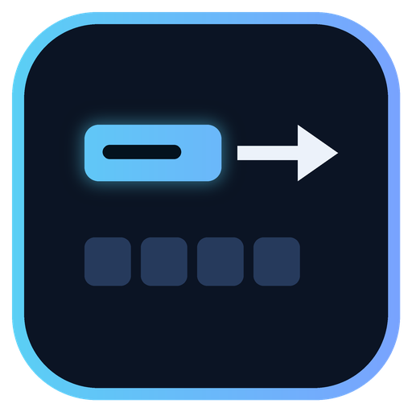

CutTheLine does not decide how urgent or important a request is, and it does not check that the problem is real. It asks one thing about each ticket: who besides the person filing is stuck — and only a problem that stops others goes to the front of the line.

<p align="center"></p>

# CutTheLine

A help desk whose queue follows reach: GenLayer validators read each ticket for whether it stops people other than the
filer. GenLayer StudioNet (chain 61999) · py-genlayer v0.2.

**The contract holds no money.** It keeps desks, tickets with how each was read, and two lanes the owner serves in order.

| | |
|---|---|
| Contract source | `contracts/BlocksOthers.py` (SHA-256 in `SOURCE_SHA256.txt`) |
| Project deployment | [`0x14A9da6B5566f79C38b79368f6d109e43fEa792a`](https://explorer-studio.genlayer.com/address/0x14A9da6B5566f79C38b79368f6d109e43fEa792a) |
| Intelligent Contract | BlocksOthers — the same frozen source, deployed separately at [`0xaD4Da7C64122D5F228F937b5d1532686468c5cCA`](https://explorer-studio.genlayer.com/address/0xaD4Da7C64122D5F228F937b5d1532686468c5cCA) |
| Evidence | `RUNTIME_EVIDENCE.md` (one tx hash per row) · `TESTING.md` |

## What it does

A desk owner opens a desk; anyone files a ticket in one line. Validators read it **once**, with the desk name, and decide:

| Outcome | Lane |
|---|---|
| `BLOCKS_OTHERS` — it stops people other than the filer | **FRONT** — served before every BACK ticket, even older ones |
| `SELF_ONLY` — it holds up only the filer | **BACK** |

Each wallet holds **one** open FRONT ticket per desk: a second BLOCKS_OTHERS ticket keeps its verdict but waits in BACK
with the note `front_lane_taken`. The owner takes the earliest FRONT ticket, and only when there is none the earliest
BACK one; lanes never change after filing. On StudioNet, "Main won't build on my laptop, so my branch can't merge." was
filed first and read **SELF_ONLY**; "Main won't build, so my branch can't merge and neither can anyone else's." was
filed after it, read **BLOCKS_OTHERS**, and was taken first.

Unclear readings count as SELF_ONLY, so no ticket jumps the queue on a guess.

## What the app shows

- **Overview**: how the reading sets the lane.
- **Desk**: a ticket box with a byte meter, your waiting count (of three) and whether your front slot is free; three
  columns — FRONT, BACK and IN PROGRESS — each ticket showing its verdict, lane, filing number, how many tickets are
  ahead and `front slot taken` when it applies; the owner's panel with the next-up ticket and *Take next*; *Resolve* for
  the owner on tickets in progress and *Withdraw* for the filer on waiting tickets. Buttons a wallet may not use are
  disabled with the contract's own sentence. A new desk can be opened at the bottom.
- **Verification**: contract address, source SHA-256, the rubric hash and the limits read from `get_limits`.

After every write the app waits for consensus to accept it, re-reads the desk and the ticket, and only then reports what
happened — for a filing, the verdict and the lane it got.

## How to try it

You need **three wallets** on GenLayer StudioNet: the desk owner and two filers. Only fees are spent.

1. **Owner** — open a desk, copy the desk link.
2. **Filer C** — file `Main won't build on my laptop, so my branch can't merge.` → SELF_ONLY, BACK.
3. **Filer B** — file `Main won't build, so my branch can't merge and neither can anyone else's.` → BLOCKS_OTHERS,
   FRONT, next up although filed later. File `The shared test database is down for everyone on the floor.` →
   BLOCKS_OTHERS but BACK, front slot taken.
4. **Owner** — *Take next* takes B's FRONT ticket first, then C's.

## Methods

| Write | Who | Checks, in order |
|---|---|---|
| `open_desk(name)` | anyone (becomes the owner) | name 1–60 → no reserved token → not opened before |
| `file_ticket(desk_id, text)` | anyone | fewer than 3 waiting → desk not full → text 1–150 → no reserved token → not filed before → **the only model call** |
| `take_next(desk_id)` | the owner | owner → a ticket is waiting |
| `resolve(ticket_id)` | the owner | owner → in progress |
| `withdraw_ticket(ticket_id)` | the filer | filer → waiting |

Views return JSON strings: `get_desk`, `get_ticket`, `get_rubric`, `get_limits`. The full specification is in
`LOCKED_SPEC.md`.

## Run locally

```bash
npm ci
npm run dev            # http://localhost:5173 (the /genlayer-rpc proxy is in vite.config.ts)
npm run build && npm test
npm run verify:source
python3 -m pytest tests/contract -q -p no:cacheprovider   # needs genlayer-test 0.29.2
```

`VITE_CONTRACT_ADDRESS` overrides the deployment address. On Vercel, `vercel.json` declares the same proxy.

## Honest limitation

1. **Urgency is deliberately not judged.** The only question is who besides the filer is stuck.
2. **It does not check that the problem is real or as wide as described** — a filer can overstate it. Nets: one front
   slot per wallet per desk, three waiting tickets, and unclear readings are SELF_ONLY.
3. **A wrong BLOCKS_OTHERS is the main risk** — one ticket jumps the queue.
4. **Requests with many non-ASCII characters** can pass the 255-byte calldata limit before 150 characters; the byte
   meter stops them.

License: MIT.
